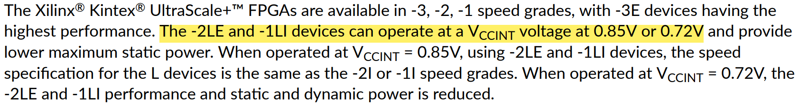

# 20230213 KU5P Design File 2

<aside>
💡 本文档为KU5P电源设计文档

</aside>

# 1. FPGA电源轨与功耗评估

## 1.1 FPGA电源轨

使用器件为翻新包上机的KU5P，速度等级为-2L，可以使用0.85V或0.72V两种供电，本设计采用0.85V，具体参考ds922, Page 1

FPGA具体电源轨与推荐电压为：ds922, Page 3

其中，VCCINT_IO必须连接至VCCBRAM，VCCAUX_IO必须连接至VCCAUX，如果未使用电池，将 VBATT连接至GND或VCCAUX.

以下用于GTY收发器的电压需要按UG 578滤波

## 1.2 FPGA功耗评估

该部分内容由@Eltecz佬完成

使用Xilinx XPE文件对器件功耗进行评估，以此为依据设计电源

[https://china.xilinx.com/products/technology/power/xpe.html](https://china.xilinx.com/products/technology/power/xpe.html)

使用最坏（同时耗电量最大情况）情况作为设计标准，具体为

- 70% LUT, FF, BRAM, DSP, all 16 GTY Serdes used.
    - PCIe Gen4 (4 GTY Channel)
    - 10G BASE-R + MAC (2 GTY Channel)
    - SATA (2 GTY Channel)
    - JESD 204B (8 GTY Channel)

- 29.1W 功率消耗，具体电流为

| 电源轨 | 最糟情况 | 设计值（初步） |
| --- | --- | --- |
| Vccint | 24.8 A | 24 A |
| Vccint_io | 0.595 A | 1 A |
| Vccbram | 0.627 A | 1 A |
| Vccaux | 0.580 A | 1 A |
| Vccaux_io | 0.395 A | 0.5 A |
| Vcco 3V3 | 0.057 A | 0.1 A |
| Vcco 2V5 | 0.057 A | 0.1 A |
| Vcco 1V8 | 0.143 A | 0.5 A |
| Vcco 1V2 | 0.234 A | 0.5 A |
| MGTYVccaux | 0.061 A | 0.1 A |
| MGTYAVcc | 1.549 A | 2 A |
| MGTYAVtt | 2.948 A | 4 A |
| Vccadc | 0.008 A  | 0.1 A |

## 1.3 上电时序

VCCINT → VCCINT_IO/VCCBRAM → VCCAUX/VCCAUXIO

GTY: VCCINT → VMGTAVCC→VMGTAVTT

参考ds922 Page 9

上电时间要求：**0.2~40ms** 之内完成从GND升高至95%目标电压（需要SPICE仿真验证）

# 2. 电源设计

按最坏情况对以上电源轨进行分析整理，整理得到以下电源轨分布。根据**DS 922，**可以发现VCCINT, VCCINT_IO, VCCBRAM可以进行合并。VCCAUX与VCC_AUXIO可以进行合并，VCCXADC可以通过1V8稳压器经过一个磁珠得到。

综合考量成本，占地面积等因素，采用以下三种芯片进行电源设计

- MYMGM1R824ELA5RA: 24A 提供内核(VCCINT相关)电流
- LTM4644: 提供高速收发器的MGTAVCC, MGTAVTT电流以及板上3V3，5V两个电源轨的电流，每路提供4A的最大电流
- TPS82130: 5个TPS82130提供三个VCCIO以及一个MGTAUX，一个VCCAUX相关的电流，每一个TPS82130可以提供最大3A的电流（需要注意，该芯片**效率较低**，需要考虑其**发热**问题）

# 3. 电源IC datasheet

## 3.1 MYMGK1R820ERSR

输入：外接12V

输出：0.85V VCCINT

上电时序：最先上电

效率：80%-90%

纹波：12V输入，满载10mV左右

## 上电时间和阈值

超过阈值开始上电，最低工作电压为8V

Start-Up Threshold Voltage

Under normal start-up conditions, converters will not begin to regulate properly until the ramping-up input voltage exceeds and remains at the Start-Up Threshold Voltage

Start-Up Time

Vin to Vout Start-Up Time (see Specifications) is the time interval between the point when the ramping input voltage crosses the Start-Up Threshold and the fully loaded regulated output voltage enters and remains within its specified accuracy band.

## 电源指示

直接将PG连接至下一个稳压器的EN端即可

Power Good (PWGOOD)

These products have power-good output that indicates high when switcher output is within the target. The power-good function is activated after soft-start has finished. If the output voltage becomes within +10% and –5% of the target value, internal comparators detect power-good state, and the power-good signal becomes high after a 1-ms internal delay. If the output voltage goes outside of +15% or –10% of the target value, the power-good signal becomes low after two microsecond (2-μs) internal delay. The power-good output is an open drain output and must be pulled up internally.

## 使能

浮空或拉高使能，拉低失能，从失能到电路稳定输出需要经过数毫秒

Remote On/Off Control (EN)

Positive logic models are enabled when the On/Off pin is **left open or is pulled high** to Vin with respect to GND. An internal bias current causes the OVP open pin to rise to Vin. Positive-polarity devices are disabled when the On/Off is grounded or brought to within a low voltage (see Specifications) with respect to GND.

## 输出电压选择

根据下面的公式和表格选择分压电阻的阻值，输出1V选择16k电阻即可

Output Voltage Adjustment

The output voltage may be adjusted over a limited range by connecting an external trim resistor (Rtrim) between the Trim pin and GND pin. The Rtrim resistor must be a 1/10W precision metal film.
type, ±0.5% accuracy or better with low temperature coefficient, ±100 ppm/deg C. or better. Mount the resistor close to the converter with very short leads or use a surface mount trim resistor.
In the table below, the estimated resistance is given at limited condition; Vin :typ.,Ta:25degC,Iout:max.,Cout:660uF. (Please look at Test Circuit which is shown below). Do not exceed the specified limits of the output voltage or the converter’s maximum power rating when applying these resistors. Also, avoid high noise at the Trim input. However, to prevent instability, you should never connect any capacitors between Trim pin and GND pin.

Output voltage depends on the value of capacitance of Cout in this product , the smaller Cout may cause the higher output voltage. The equations above are only reference, so please check output voltage and adjust Rtrim in user circumstances. To increase (decrease) output voltage is obtained by decreasing(increasing) value of Rtrim

## 输入输出滤波电容

- 输入：采用低ESR的Murata GRM32系列或Panasonic OSCON系列，使用22 uF x 2 或 47uF x 2 陶瓷电容+1000uF 电解质电容，耐压值应该至少为输入电压的2倍
- 输出：采用低ESR的220 uF x 3陶瓷电容

<aside>
💡 多余的输出电容可能会导致环路不稳，不要超过最大输出电容限制

</aside>

对应datasheet原文：

*Recommended Input Filtering*

*The user must assure that the input source has low AC impedance to provide dynamic stability and that the input supply has little or no inductive content, including long distributed wiring to a remote power supply. For best performance, we recommend installing a low-ESR capacitor immediately adjacent to the converter’s input terminals. The capacitor should be a ceramic type such as the Murata GRM32 series and a electrolytic type such as Panasonic OSCON series. Initial suggested capacitor values are 22 uF x 2 or 47uF x 2 ceramic type and 1000uF x 1 electrolytic type , rated at twice the expected maximum input voltage*

*Recommended Output Filtering*

*The converter will achieve its rated output ripple and noise with additional external capacitor. The user may install more external output capacitance reduce the ripple even further or for improved
dynamic response. Again, use low-ESR ceramic (Murata GRM32 series). Initial values of 220 uF x 3 ceramic type may be tried, either single or multiple capacitors in parallel. Mount these close
to the converter.*

*Excessive capacitance can make step load recovery sluggish or possibly introduce instability. Do not exceed the maximum rated output capacitance listed in the specifications.*

封装与引脚定义

推荐的PCB Layout

根据以上内容完成AD内原理图绘制

## 3.2 LTM4644

输入：4通道均外接12V

输出：5V System 5V, 3V3 System 3V3, 0V9 MGTAVCC, 1V2 MGTAVTT

上电时序：5V, 3V3 与VCCINT同时（最先）上电，之后0V9（等待VCCINT PG信号） —>1V2 （等待0V9 MGTAVCC PG信号）

使能引脚（Run）开始上电电压：1V2

*Enable regulator operation by tying the specific RUN pin above 1.2V*

上电时间：2.5 ms（0.01uF track/ss cap）25 ms （0.1uF track/ss cap）

效率：80%~90%

输出纹波：5mV

去耦电容：

FB引脚电阻确定：

MODE引脚

选择稳压器工作的模式：DCM&CCM，DCM为能效较高，CCM纹波最小

PCB布局要点

根据以上内容完成AD原理图绘制

## 3.3 TPS82130

工作模式：PSM（轻载）与PWM（满载），无缝切换，PSM模式下纹波较大

As the load current decreases, the converter enters power save mode, reducing the switching frequency and minimizing the quiescent current of the IC to achieve high efficiency over the entire load current range. DCS-Control supports both operation modes using a single building block and therefore has a **seamless** transition from PWM to PSM without effects on the output voltage.

推荐引脚最大电压值：**PG上拉不建议超过6V**

EN/PG阈值

SS/TR: 上电时间控制，通过外接电容控制上电斜率，EN拉高后55us，稳压器根据外接电容的大小控制上电斜率

*The internal voltage clamp controls the output voltage slope during start-up. This avoids excessive inrush current and ensures a controlled output voltage rise time. When the EN pin is pulled high, the device starts switching after a delay of typically 55 μs and the output voltage rises with a slope controlled by an external capacitor connected to the SS/TR pin. Using a very small capacitor or leaving the SS/TR pin floating provides the fastest start-up time.*

效率：较低，需要注意发热问题

输出纹波：根据不同模式纹波大小不同

输入/输出电容：

输入：10uF

输出：22uF

SS/TR：电容值决定上电斜率，小电容上电最快

PCB Layout建议：

根据以上内容设计原理图

