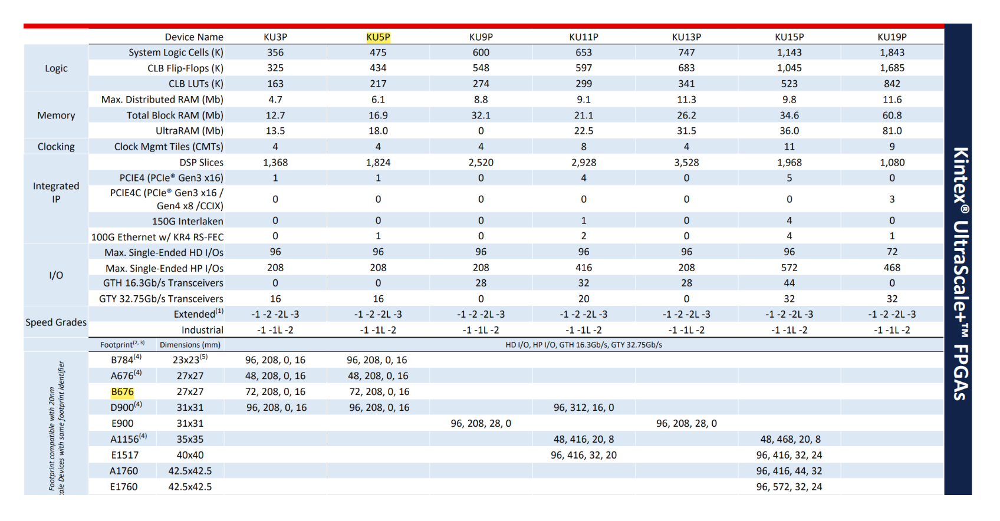

# KU5P Development File

# 一. 预研&预算

## 1. 预期目标

（1）验证电源系统可靠性

（2）验证翻新芯片可靠性

（3）信号完整性/电源完整性测试（optional）

## 2. **FPGA芯片选型&资源**

拆机KU5PFFVB676包测（成本考量），逻辑资源与封装见下图

## **3. 板卡外形与外设：**

采用半高半宽单槽设计

外形尺寸：长：200 mm 宽：66 mm

（1）FMC HPC座，引出LA Pin + 8 sereds（GTY），如果空间充足则尽可能的把HA Pin引出来

（2）SFP Cage * 2 4 Serdes

（3）USB Type-C for uart

（4）FT 4232 for JTAG

（5）DDR*2/4，视拉线空间决定

（6）PCIe (x4) 4 Serdes

*（7）SATA/XH 2.54/Another FMC LPC：视布线情况决定*

根据FPGA引脚分布决定板卡外设/大致布局，优先照顾Serdes&HP Bank走线短

Serdes: 4 PCIe, 4 SFP, 8 FMC HPC Connector

HP Bank: 4 Bank(4 groups in a single bank, ADDR&CLK: 3 groups, DQ: 1 group)

预布局规划

3D结构

## **4.阻抗&叠层**

**目标工艺**：

层数：华秋12层 板材：TG-170, FR-4 最小线宽孔距：3.5/3.5 mil/mil, 0.2mm 阻抗+沉金（1μm）

**阻抗要求**（检查xilinx datasheet）：

DDR：

QSFP：

FMC：

PCIe：

**叠层**：

**12层，5层参考层，2层电源层，5层信号层**。具体数据待与华秋联系取得叠层/阻抗模板等

## **5.预算（两套贴好的板卡）**：

PCB打样：1600￥

SMT贴片费用：500￥

元器件：1300￥

FPGA芯片：KU5P翻新包上机*2 1200￥

总：4500￥

## **6.相关文档**

**DS 922:** Kintex UltraScale+ FPGAs Data Sheet: DC and AC Switching Characteristics

**DS 890:** UltraScale Architecture and Product Data Sheet: Overview

**UG 583:** UltraScale Architecture PCB Design User Guide

**UG 575:** UltraScale and UltraScale+ FPGAs Packaging and Pinouts

## **7.设计进度**

- [x]  预研&规划文档 （2023-2-12）
- [ ]  原理图设计
    - [ ]  电源
    - [ ]  DDR
    - [ ]  PCIe
    - [ ]  SFP
    - [ ]  时钟
    - [ ]  其他外设